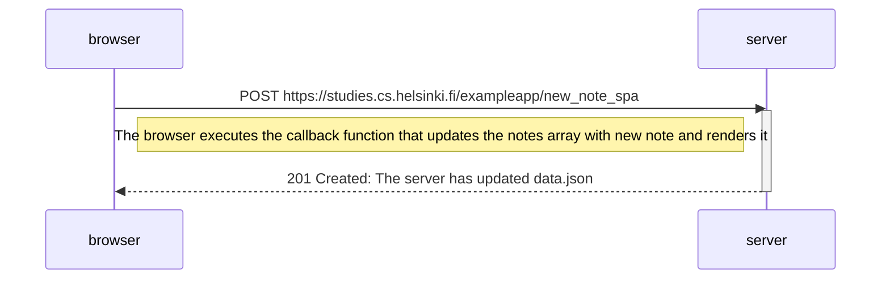

# New note request in SPA diagram

```mermaid
  sequenceDiagram
    participant browser
    participant server

    browser->>server: POST https://studies.cs.helsinki.fi/exampleapp/new_note_spa

    activate server

    note right of browser: The browser executes the callback function that updates the notes array with new note and renders it

    server-->>browser: 201 Created: The server has updated data.json

    deactivate server
```
